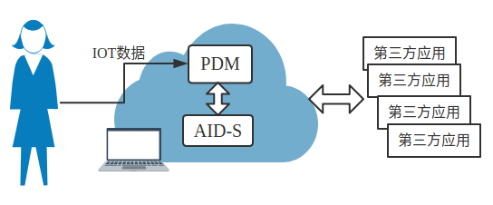

# A Framework for personal data protection in the IOT



要点总结：

介绍框架和框架中各个模块的功能，并没有给出模块功能的具体实现方式，框架完成度很低。

## 立题依据

存在的问题：

物联网：可穿戴设备、智能家居、fitness device、health care monitoring system  
 -》物联网设备产生的数据可能会泄漏大量个人隐私信息（一些研究案例）  
 -》关于个人隐私的提案集中在用户控制数据存储和第三方应用/设备的数据访问控制上（参考文献）  
 -》访问控制的问题：第三方的数据泄漏。the problem of possible inferences since they can be coming from the third parties which are granted with authorized access by the user.

知识点补充：An [**Inference Attack** ](https://en.wikipedia.org/wiki/Inference_attack)is a data mining technique performed by analyzing data in order to illegitimately gain knowledge about a subject or database.

* 
贡献：个人数据保护的通用框架

基于adaptive inference discovery service\(自适应推理发现服务\)\[10\]，综合 个人数组管理功能 与 推理发现功能 ，同时考虑了个人对隐私的感知，提出了一个通用框架：框架总体结构、各模块的描述、模块之间的交互、不同的个人数据管理平台的集成案例

框架的创新点：以用户为中心，综合个人数据管理与推理发现功能的优势，使用户能更好的控制自己的数据；可以应用到智能手机上的应用或者社交网络中的数据共享。

相关工作：

inference attack——针对这个问题，提出computer security reference

* identity disclosure
* attribute disclosure——本文主要讨论在identity对IOT第三方已知的情况下的属性隐私
* rule disclosure

针对性技术：

* anonymization 匿名化：隐藏与identity有关的信息，仅发送第三方需要的数据。从所有与主体有关的信息中分离出与可识别的数据
* transformation, also referred to as obfuscation 混淆, perturbation 扰动, sanitization 净化：对原始数据进行一般化和扰动 \[11, 12, 14\]

本文思路：当第三方需要从用户采集数据时，采用transformation技术。若第三方强制要求访问用户的隐私数据，由&lt;PDM + AID-S&gt;进行调节

## 框架描述——以用户为中心的隐私管理框架

类似框架：ipShield，解决安卓机上第三方对传感器的直接访问。本文提出的是更为通用的框架，可以管理手机个人数据的各种设备。

Personal Data Manager - PDM，其中包含一个应用程序，用来 为用户 就个人信息的管理的问题 与第三方应用进行交互 提供支持。

因为PDM不能解决inference attack的问题，本文又引入AID-S，作为PDM的插件（不强制绑定）。

体系结构：物联网设备的信息都上传到PDM；在授权第三方应用访问数据之前，PDM检查应用的访问策略与用户的隐私设置是否一致，AID-S计算所请求数据的inference risk。

### PDM

#### 对话管理 Dialog management

提供API，协调用户、第三方应用、AID-S之间的通信，

* PDM2User
* PDM2ThirdParty
* PDM2AID-S

#### Policy Statement evaluation

第三方应用需要在policy statement中声明的内容：

* the list of user data it need to sense, process, store\(如歩数、高度、心率等\)
* the list of further data it will need for providing the service\(age, gender\)
* the list of user data it will ask from other third party\(GPS等\)

目的：evaluate if the third party request respects the privacy setting of the user.

#### 认证与授权

PDM的基本功能——访问控制

* user：PDM部署在远程服务器上时会用到，部署在用户PC上不用
* third party：管理经过认证的第三方列表，用身份认证协议保护与第三方的交易；经过认证且请求通过的第三方才会被授权。

#### 隐私偏好设置

PDM的一个重要任务：创建用户配置文件user profile，用来描述用户的隐私偏好；PDM根据用户的配置文件，创建规则。

用户的隐私偏好设置 表示 the user's perception about confidentiality about his/her personal data.

#### existing tasks of current PDMs

* authentication and authorization 认证与授权 - PDM都有实现
* Authentication and authorization, policy statement evaluation = Enigma's access control, 区块链+链下存储
* \[15\] addressed all our tasks and manage further tasks: policy statement evaluation, data processing, knowledge extraction, access control, secure data storage. 允许用户take conscious and informed decisions\(比如与user/service共享数据\)
* access control, policy statement evaluation, privacy preference setting - ipShield.

### AID-S

根据一组输入数据，预测inference risk，提供降低inference risk的方案。

Reference risk computation tasks start on the PDM's request regarding possible inference attacks of a third party in the case its policy statement is accepted. 在PDM接受第三方应用的policy statement之后调用，用来评估其reference risk。

输入：user profile with the privacy preference settings, policy statement of the third party  
输出：reference risk and solutions to reduce the risk.

#### 隐私偏好与 threshold estimation

根据privacy preference setting in the user profile   
 -》estimate the privacy values  
 -》reference risks 不是一个具体的数值，

the reference risk is not a absolute value, it is related to the user's perception about the confidentiality of his/her data.

#### inference risk estimation

D: user data set, P\(D\): D的幂集， ai: element in D, ci: subset of D, element in P\(D\),  
P\(ai\|ci\) in \[0, 1\]

基于 inference matric, 结合privacy preference，可以计算inference risk。具体计算方案给了几个参考文献。

#### 策略推荐——用户隐私与服务可用性的权衡

1. 推荐最佳隐私设置：哪些数据项不建议共享，哪些数据项可以共享（根据inference risk）
2. recommending data transformation（数据混淆，数据扰动）— 方案来自参考文献

### 工作流程

1. 初始化：从PDM收到第三方应用的policy statement开始。 -》PDM检查第三方所需的个人数据，向AID-S发送推理检查请求（以及user profile） -》AID-S根据user profile计算preference and threshold -》
2. 实时监控

## 未来工作

* 形式化与通信协议
* solution形成的具体协商过程
* 框架实例化：具体模型的定义
* 隐私阈值设置模型、推荐策略、推理指标定义

说明：图片来自论文

